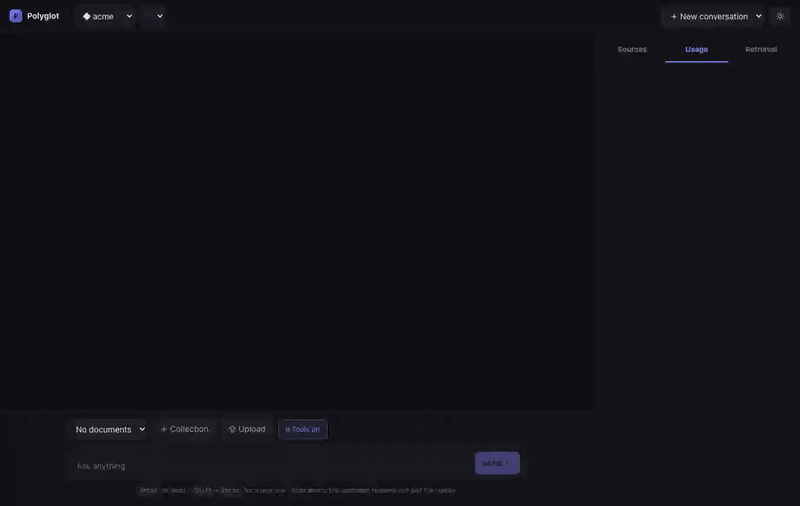

# Polyglot — Multi-Provider AI Workbench

One interface, several providers, several tenants, full visibility into what
every request costs and how long it took.

---

## Demo

Thirty seconds, one pass over every module: streaming chat, a provider swapped
mid-conversation, tool calling, a document uploaded and answered with citations,
retrieval tuned live, the cost and latency panel, and a tenant switch.



▶ **[Watch at full resolution (MP4, 1280×810)](docs/demo.mp4)** — the GIF above is a
lower-fidelity preview of the same recording.

| Time | On screen |
| ---- | --------- |
| 0:00 | **A** — five models across three providers, behind one interface |
| 0:02 | **B** — chat streamed token-by-token over SSE, then TTFT, latency, tokens and USD cost for that request |
| 0:06 | **B** — provider switched to Gemini *inside* the conversation; it answers what was asked first, because history is stored provider-agnostic |
| 0:10 | **D** — tools on, model switched to a third provider, `calculator` and `get_weather` called in one turn and their arguments and results shown |
| 0:18 | **C** — a collection created and a document uploaded: chunked with overlap, embedded, stored in pgvector |
| 0:23 | **C** — the answer grounded in that document with an inline citation, and every retrieved chunk visible with its similarity |
| 0:26 | **C** — top-k, similarity threshold and chunking tuned at runtime |
| 0:27 | **E** — spend and latency aggregated per provider, then a tenant switch: the panel reloads against `globex`, which sees its own rows and nothing else |

Nothing in the recording is mocked or sped through a stub: every answer is a live call
to Anthropic, Google and OpenAI, and the latency and dollar figures on screen are the
ones those calls actually produced. The recording runs at 1.75× so it fits in 30
seconds.

---

## Setup (under 5 minutes)

**Prerequisites:** Node 20+, and Postgres 14+ with `pgvector` available.

```bash
git clone <this-repo> && cd polyglot
npm install
cp .env.example .env          # then fill in at least one provider key
```

Create the database and its owner role, and install the extensions. The
extensions step needs a **superuser**, because the app's owner role is
deliberately _not_ one — a superuser bypasses row-level security outright,
which would hollow out the entire tenant model:

```bash
psql -d postgres -c "CREATE ROLE polyglot LOGIN PASSWORD 'polyglot' CREATEROLE CREATEDB;"
createdb -O polyglot polyglot
psql -d polyglot -c "CREATE EXTENSION vector; CREATE EXTENSION pgcrypto;"
```

Then:

```bash
npm run db:push               # tables, the polyglot_app role, RLS policies, HNSW index
npm run db:seed               # creates the "acme" and "globex" demo tenants
npm run dev                   # api on :3001, web on :3000
```

Open [http://localhost:3000](http://localhost:3000).

**No Postgres handy?** `docker compose up -d` starts one with pgvector
preinstalled, matching the default `DATABASE_URL`. **macOS/Homebrew:**
`brew install pgvector && brew services restart postgresql@18` before the
`CREATE EXTENSION` step above.

### Verify without touching a provider

```bash
npm test            # 67 tests
npm run check-types
npm run verify      # resolves every configured provider to its adapter, prints the cost maths
```

The adapter tests use recorded request/response fixtures, so they prove the
request and response mapping is correct with **no API keys and no network**.

`packages/db/test/isolation.test.ts` is the exception: 7 integration tests that
connect as `polyglot_app` and try what a careless engineer would — reading
another tenant's row by id, inserting under someone else's `tenant_id`, turning
RLS off. They skip automatically when `DATABASE_APP_URL` is unset.

---

## What is implemented

### Providers

| Provider      | Adapter file                | Status                                                        |
| ------------- | --------------------------- | ------------------------------------------------------------- |
| Anthropic     | `adapters/anthropic.ts`     | Full — complete, stream, tools             |
| Google Gemini | `adapters/gemini.ts`        | Full — complete, stream, tools, embeddings |
| OpenAI        | `adapters/openai-compat.ts` | Full — complete, stream, tools, embeddings |

Three providers, satisfying §3.A's requirement of Anthropic + Gemini + one of
OpenAI/Groq/DeepSeek. Anthropic and Gemini are the two that genuinely disagree
with everyone else, which is where the abstraction earns its keep.

**Groq and DeepSeek are deliberately not shipped**, but the `openai-compat`
adapter already handles both of their quirks — Groq's `x_groq.usage` and
DeepSeek's separate `reasoning_content` — driven by config rather than code, and
`test/openai-compat.test.ts` covers both paths. Enabling either is one entry in
`models.json` plus a key. That is the extensibility claim, demonstrated rather
than asserted.

> **Live-key testing:**

| Config id | Display name | Provider |
| --- | --- | --- |
| `anthropic:claude-sonnet-4-6` | Claude Sonnet 4.6 | Anthropic |
| `anthropic:claude-haiku-4-5` | Claude Haiku 4.5 | Anthropic |
| `google:gemini-2.5-flash` | Gemini 2.5 Flash | Google |
| `google:gemini-2.5-pro` | Gemini 2.5 Pro | Google |
| `openai:gpt-5.6-luna` | GPT-5.6 Luna | OpenAI |

### Modules

| Module                             | Status   | Notes                                                                                                                                                                                                                                                                                                                                                                                                                                                                                                                 |
| ---------------------------------- | -------- | --------------------------------------------------------------------------------------------------------------------------------------------------------------------------------------------------------------------------------------------------------------------------------------------------------------------------------------------------------------------------------------------------------------------------------------------------------------------------------------------------------------------- |
| **A — Provider abstraction**       | **Done** | The contract, the three adapters, dynamic registry, config-driven models and pricing, normalized error taxonomy, 45 adapter/core tests.                                                                                                                                                                                                                                                                                                                                                                               |
| **B — Chat with true streaming**   | **Done** | SSE, token-by-token. Provider and model switchable between messages inside one conversation. Persisted in Postgres. Stop aborts the upstream request. Context overflow truncates oldest-first and says so in the UI.                                                                                                                                                                                                                                                                                                  |
| **C — RAG**                        | **Done** | PDF/TXT/MD upload, paragraph-aware chunking with overlap, pgvector cosine retrieval, inline citations, chunk text visible in the UI, explicit "I don't know" grounding. Chunk size, overlap, top-k and the similarity threshold are tunable at runtime from the sidebar, per collection. The two ingest-time parameters are labelled as such in the UI: they apply to documents uploaded afterwards, because re-chunking existing documents means paying to re-embed them and that is not something to do implicitly. |
| **D — Tool calling**               | **Done** | `calculator`, `get_weather`, `search_documents`. One definition format, translated per provider. Multi-round loop, streamed and accumulated arguments, graceful degradation when a model has no tool support.                                                                                                                                                                                                                                                                                                         |
| **E — Observability & resilience** | **Done** | Per-request TTFT, total latency, tokens (incl. cached/reasoning), USD cost, finish reason, retry count, fallback flag. Aggregate spend and latency by provider. Exponential backoff with full jitter on `rate_limit`/`server_error`/`timeout` only. Configurable fallback chain, surfaced in the UI when it fires.                                                                                                                                                                                                    |

### Cut deliberately

- **Optional extras.** None of Section 6 is built. Scoped out entirely to
  protect the required modules rather than ship any of them partially.
- **Background ingestion.** Uploads are processed synchronously in the request.
  The `status` column exists precisely so this can become a queue without a
  schema change.
- **Authentication.** The tenant comes from an `x-tenant-id` header. A caller
  can forge it. That is a deliberate take-home simplification and the
  enforcement model is designed so replacing it touches one file — see
  `docs/DESIGN.md`.
- **Re-indexing on settings change.** Changing chunk size or overlap does not
  re-chunk documents already ingested; you re-upload. Doing it automatically
  means re-embedding the whole collection on a slider drag.
- **UI polish.** Plain CSS, no markdown rendering, no virtualized transcript.
  Adapter quality was protected above UI, per the brief's own advice.

---

## Adding a fourth provider

Two things, and nothing else in the codebase changes:

1. **One file:** `packages/providers/src/adapters/<name>.ts`, default-exporting
   an object that satisfies `Provider`.
2. **One config block** in `packages/config/models.json` — a `providers` entry
   naming that adapter and the env var holding its key, plus a `models` entry
   per model you want to expose.

There is no barrel file, no `switch`, and no registration call. The registry
resolves the adapter by dynamic import from the `adapter` field in config.
Worked example in `docs/DESIGN.md`.

---

## Layout

```
apps/
  api/        Fastify: SSE chat, RAG, metrics, tenant guard, tools
  web/        Next.js 15 App Router: chat UI, citations, metrics panel
packages/
  core/       The contract: types, error taxonomy, config loader, cost, retry
  providers/  Adapters + registry + orchestrator (retry, fallback, timeouts)
  db/         Drizzle schema, RLS policies, tenant-scoped client
  config/     models.json — models, capabilities, pricing, defaults
docs/
  DESIGN.md           architecture, tenant model, security posture, decisions
  PROVIDER_NOTES.md   the concrete API differences and how they were reconciled
  AI_USAGE.md         what AI assistance was used for, and what was rejected
```

## Notable constraint

**No provider-abstraction framework is used.** No LangChain, no LlamaIndex, no
Vercel AI SDK, no LiteLLM, no OpenRouter. The HTTP calls, the SSE parsing and
the streaming are hand-written, because the abstraction is the assignment.
