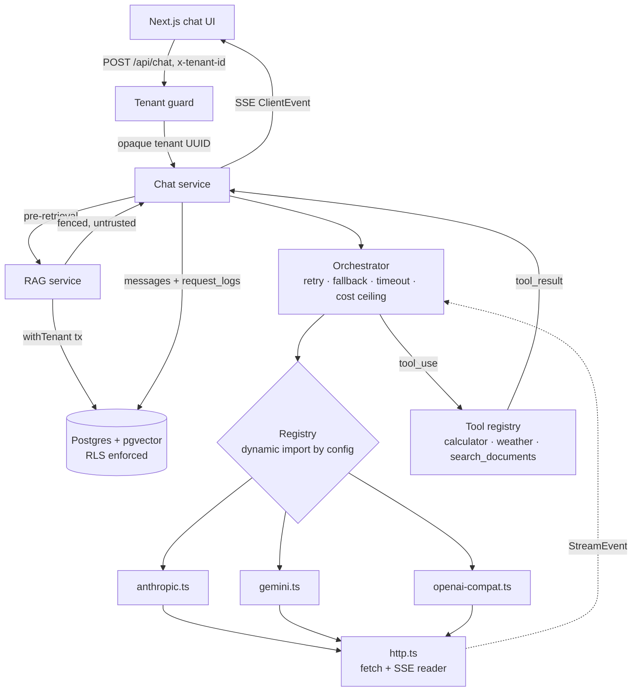

# Design

## 1. Request flow



One turn, end to end:

1. The browser POSTs to `/api/chat` with an `x-tenant-id` header and reads the
   response as SSE.
2. The tenant guard is the **only** place the tenant is decided. It resolves the
   header to a UUID and attaches it to the request.
3. If a collection is selected, the RAG service embeds the question, runs a
   cosine search inside a tenant-pinned transaction, and builds a grounded
   system prompt with the retrieved chunks fenced as untrusted data.
4. The orchestrator picks the model, fits the transcript to its context window,
   and calls the adapter — retrying only retryable failures, falling back down
   the chain only if nothing has been emitted yet.
5. The adapter translates our `CompletionRequest` into the vendor's shape, opens
   the HTTP stream, and translates the vendor's events back into `StreamEvent`s.
6. If the model asked for tools, the chat service executes them, appends the
   results, and loops — up to five rounds.
7. Every message and every request metric is written back inside a tenant-pinned
   transaction; the SSE stream closes.

## 2. How the provider abstraction is layered

```
apps/api                ← knows nothing about any vendor
  services/chat.ts      ← the agentic loop; speaks Message + StreamEvent only
packages/providers
  orchestrator.ts       ← retry, fallback, timeout, metrics, cost ceiling
  registry.ts           ← config → adapter, by dynamic import
  adapters/*.ts         ← THE ONLY place vendor shapes exist
  http.ts               ← fetch, timeouts, cancellation, SSE framing
packages/core
  types.ts              ← the contract
  errors.ts             ← the taxonomy every adapter normalizes into
  models.ts             ← config validation, cost maths
```

The rule the layering enforces: **nothing above `adapters/` may import or
mention a vendor shape.** No `choices[]`, no `candidates[]`, no
`content_block_delta`. If a grep for those strings ever matches outside
`adapters/`, the abstraction has leaked.

### Exactly what you would write to add a fifth provider

Say Mistral. **One file:**

```ts
// packages/providers/src/adapters/mistral.ts
import type { Provider } from '@polyglot/core';
import { postJson, readSse } from '../http.js';

const mistral: Provider = {
  name: 'mistral',
  async complete(req, ctx) { /* map req -> body, response -> CompletionResponse */ },
  async *stream(req, ctx) { /* yield StreamEvents from readSse(...) */ },
};

export default mistral;
```

**One config block:**

```jsonc
"providers": {
  "mistral": {
    "adapter": "mistral",
    "apiKeyEnv": "MISTRAL_API_KEY",
    "baseUrl": "https://api.mistral.ai/v1"
  }
},
"models": {
  "mistral:mistral-large-latest": {
    "provider": "mistral",
    "providerModelId": "mistral-large-latest",
    "displayName": "Mistral Large",
    "contextWindow": 131072,
    "maxOutputTokens": 8192,
    "capabilities": { "tools": true, "vision": false, "jsonSchema": true, "streaming": true },
    "pricing": { "inputPerMTok": 2.0, "outputPerMTok": 6.0 }
  }
}
```

Plus `MISTRAL_API_KEY` in `.env`. **No other file changes.** Not the registry,
not a barrel, not the UI — the model picker, the cost table and the fallback
chain all read from config. If Mistral's surface were OpenAI-compatible, even
the file would be unnecessary: point `adapter` at `openai-compat` and the shared
adapter handles it, as it already does for Groq and DeepSeek.

## 3. Tenant isolation

The brief's four questions, answered directly.

### Where does the tenant identifier come from, and can a caller forge it?

From the `x-tenant-id` request header, resolved to a UUID in
`apps/api/src/middleware/tenant.ts`. **Yes, a caller can forge it today** —
there is no authentication, by design, for a take-home.

What matters is that this is the only place the tenant is decided. Everything
downstream receives an opaque, already-validated UUID it cannot influence, and
no route handler reads the header. Replacing the header with a verified session
cookie or a JWT claim is a change to one function body; the rest of the system
does not know the difference.

The tenant identifier is also never accepted from the model. `search_documents`
takes its `tenantId` from the request context, never from the tool arguments —
otherwise a prompt-injected document could talk the model into asking for a
different tenant's index.

### Where is the boundary actually enforced?

**In Postgres, by row-level security.** Not in application code.

- Every tenant-owned table has a `NOT NULL tenant_id` and a policy:
  `USING (tenant_id = current_tenant_id()) WITH CHECK (tenant_id = current_tenant_id())`.
- The app connects as `polyglot_app`, which is **not** the table owner and does
  **not** have `BYPASSRLS`. It cannot disable the policy.
- Tables use `FORCE ROW LEVEL SECURITY`, so the policy applies to the owner too.
  Without `FORCE`, a migration script or a `psql` session would silently see
  everything.
- `withTenant()` opens a transaction and calls
  `set_config('app.current_tenant', $1, true)`. The `true` makes it **local to
  the transaction**, so it is discarded on commit or rollback. With a connection
  pool, a session-level setting would leak to whatever request borrowed that
  connection next — that is the specific bug this design exists to prevent.
- `current_tenant_id()` returns `NULL` when unset, which makes every policy
  comparison `NULL`, which denies. **Forgetting to call `withTenant()` returns
  zero rows, not every row.** The failure mode points the safe way.

### A new engineer joins on Monday and writes a query. What stops them?

Postgres does.

They cannot get a database handle that is not tenant-scoped: `withTenant()` is
the only exported way to reach the app connection, and the owner connection is
marked "never import this from a route handler" and is used in exactly two
places (migrations, and the tenant-slug lookup that by definition precedes a
tenant context).

If they write `select * from messages` inside `withTenant`, they get their own
tenant's messages. If they somehow write it outside, they get **nothing** —
because `current_tenant_id()` is `NULL`. There is no query they can write, from
the application role, that returns another tenant's rows. The boundary is
structurally true, not conventionally true.

You can see this in the route handlers: `conversations.ts` fetches a
conversation by id with **no** `tenant_id` filter, on purpose. A row belonging
to another tenant is not filtered out — it is invisible, and the handler 404s.

### How would you know, in production, if it had ever leaked?

Honestly: the mechanisms are scaffolded, not proven.

- `tenant_access_log` is an append-only table (the app role has `INSERT` but
  `UPDATE`/`DELETE` are revoked) recording every tenant context opened, with the
  route and request id.
- `request_logs.tenant_id` means spend is attributable per tenant, so a tenant
  being billed for traffic it did not generate is detectable.

What I would add before production, and have not: a periodic assertion job that
runs a known-hostile query as `polyglot_app` with no tenant set and alerts if it
ever returns rows; row counts per tenant compared against the access log; and a
CI test that fails if any new table is created without a policy.

## 4. Security posture

### What is protected against

- **No `eval()` on user input.** The calculator is a hand-written
  recursive-descent parser whose only possible output is a number.
  `test/calculator.test.ts` asserts that `process.env...`, `require(...)`,
  `constructor.constructor(...)` and an infinite loop are all parse errors.
- **Retrieved document content is untrusted data, not instructions.** Chunks go
  into a fenced region with an explicit instruction that everything inside it is
  data; fence delimiters are stripped from chunk text so a document cannot close
  the fence early and escape into instruction space; a test asserts exactly two
  fence markers survive a hostile document. All three shipped tools are
  read-only by construction.
- **No secrets leave the server.** API keys live in `.env`, are read only in
  `registry.ts`, and the browser bundle imports no provider code at all.
  `/api/models` exposes a `configured` boolean, never the key or its value.
  Fastify's logger redacts `authorization`, `x-api-key`, `x-goog-api-key`.
- **No raw provider errors reach the client.** `ProviderError.raw` holds the
  upstream body for logs; `toClient()` returns a fixed, generic message per
  error kind. A test asserts a key echoed in a 401 body never appears in the
  client projection.
- **Keys are never in URLs.** Gemini accepts `?key=` — we send
  `x-goog-api-key` instead, because URLs end up in access logs, proxy logs and
  browser history. A test asserts the key is absent from the request URL.
- **Input validation everywhere.** Every route body and every tool argument is
  parsed with zod before use. Uploads are validated on **both** declared MIME
  type and extension, size-capped by `@fastify/multipart`, and the filename is
  never used to build a path.
- **Bounded cost and time.** Per-request timeout, body size limit, upload size
  limit, and a per-request USD ceiling checked mid-stream that aborts a runaway
  generation.
- **SQL injection.** Every query goes through Drizzle's parameterization,
  including the pgvector literal. `withTenant` additionally rejects a non-UUID
  before it reaches `set_config`.

### Consciously left out for a take-home

- **Authentication and authorization.** No login, no sessions, no roles. The
  tenant header is forgeable, as stated above.
- **Rate limiting and quota per tenant.** There is a per-request cost ceiling
  but no per-tenant budget, so one tenant can exhaust a shared provider quota.
- **Audit completeness.** `tenant_access_log` is written but nothing reads it.
- **Egress control.** `get_weather` calls a fixed public API, but there is no
  general allowlist preventing a future tool from reaching an internal address.
- **Encryption at rest, key rotation, secret manager.** `.env` only.
- **PII handling in logs.** Prompts are not logged today, but nothing enforces
  that they never will be.

### What I would add before production

1. Real auth with the tenant as a signed claim, plus the CI test that fails when
   a table is created without an RLS policy.
2. Per-tenant rate limits and spend budgets, enforced before the provider call.
3. An SSRF allowlist for any tool that takes a URL, and a sandbox for tool
   execution.
4. The leak-detection job described above, wired to an alert.

## 5. Decisions

| # | Chose | Rejected | Why |
|---|---|---|---|
| 1 | Hand-written HTTP + SSE per adapter | Official vendor SDKs | Three SDKs means three streaming idioms, three error hierarchies and three cancellation stories to normalize — more surface, not less. Plain `fetch` makes the differences explicit and the tests trivial to mock. (Frameworks like LangChain/Vercel AI SDK are forbidden by the brief regardless.) |
| 2 | Adapter resolved by dynamic import from config | A registry map or a barrel file | A barrel would mean adding a provider touches two files, breaking the extensibility claim. The adapter name is regex-constrained in the config schema, so config can never import an arbitrary path. |
| 3 | One `openai-compat` adapter for OpenAI, Groq and DeepSeek | Three separate files | Their differences are configuration (base URL, `stream_options` support, usage location, reasoning field name), not shape. Three near-duplicate files is the anti-pattern the brief calls out. |
| 4 | Postgres + pgvector | Qdrant, Chroma, FAISS | We already need Postgres for tenancy. A second datastore needs its own tenant isolation story, and "the vector DB has no RLS" is exactly how a cross-tenant leak happens. One boundary beats two. |
| 5 | RLS with a non-owner role | Filtering by `tenant_id` in a repository layer | A repository layer is a convention: one forgotten `where` leaks. RLS makes the correct behaviour the default and the incorrect one impossible from the app role. |
| 6 | Truncate oldest-first on context overflow | Summarize the dropped prefix; hard reject | Summarizing costs an extra model call per overflow and adds a second place hallucination can enter the transcript. Rejecting makes long RAG conversations unusable. Truncation is lossy but predictable, and the UI says it happened. |
| 7 | No fallback after the first token | Fall back at any point | Splicing a second model's output onto a half-finished sentence produces incoherent transcripts the user cannot detect. Failing visibly beats succeeding wrongly. |
| 8 | `cacheWriteTokens` added to `Usage` | Folding cache writes into cached tokens | Anthropic bills cache writes at 1.25× input and reports them separately. Merging them misprices every first request against a cached prefix. |
| 9 | Synchronous ingestion | A job queue | A queue is the right answer and the `status` column is there for it, but it needs a worker, a broker and a polling UI — a day of work that scores nothing. Cut honestly. |
| 10 | Money as `numeric(12,6)` | `float`/`real` | Floating-point money accumulates error across thousands of rows, and the aggregate view is the whole point of Module E. |

## 6. What I would do differently with more time

1. **Make the streaming transport pluggable.** Right now SSE is assumed from the
   adapter to the browser. Anthropic and OpenAI both support partial-JSON
   streaming for structured output, and a WebSocket transport would let the
   client cancel without tearing down the HTTP connection. The `StreamEvent`
   union is already transport-agnostic; the API layer is not.

2. **Replace truncation with a summarize-and-pin strategy.** Truncation loses
   the beginning of long RAG conversations, which is usually where the user
   stated what they actually wanted. Summarizing the dropped prefix into a
   pinned system note would keep intent while staying inside the window — at the
   cost of an extra call and a place hallucination can creep in, which is why it
   is future work rather than a default.

3. **Property-test the adapters against a shared conformance suite.** Each
   adapter has its own test file today, which means a new adapter can silently
   skip a behaviour. One table-driven suite that every registered adapter must
   pass — same fixtures, same assertions on `Usage` normalization and tool
   accumulation — would make the contract executable rather than documented.
